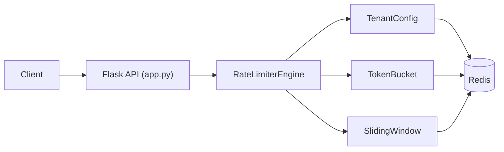

# Rate Limiter as a Service — Project Guide

A standalone microservice that enforces API rate limiting for multiple tenants. It supports two algorithms, stores all state in Redis, and exposes a simple REST API.

**Stack:** Python 3, Flask, Redis, Docker

---

## Table of Contents

1. [What It Does](#what-it-does)
2. [Architecture](#architecture)
3. [Project Structure](#project-structure)
4. [Rate Limiting Algorithms](#rate-limiting-algorithms)
5. [Redis Data Model](#redis-data-model)
6. [REST API](#rest-api)
7. [Per-Tenant Configuration](#per-tenant-configuration)
8. [How to Run](#how-to-run)
9. [Testing](#testing)
10. [Benchmarking](#benchmarking)
11. [Environment Variables](#environment-variables)
12. [Design Decisions](#design-decisions)
13. [Scaling & Interview Notes](#scaling--interview-notes)

---

## What It Does

When a client makes an API call, another service (or a gateway) can call this rate limiter first:

```
Client → API Gateway → Rate Limiter → Allow (200) or Block (429)
```

Each **tenant** (user ID, API key, org ID, etc.) gets its own limit. Limits are configurable at runtime — no restart required.

**Example:** Tenant `user_123` is allowed 5 requests per 60 seconds. Requests 1–5 return `200`. Request 6 returns `429 Too Many Requests`.

---

## Architecture



**Request flow for `POST /check`:**

1. Flask receives `{ "tenant": "user_123" }`.
2. `RateLimiterEngine` loads config for that tenant from Redis.
3. Engine picks the algorithm (`token_bucket` or `sliding_window`).
4. Algorithm reads/writes counters in Redis atomically.
5. Flask returns `200` (allowed) or `429` (blocked) with remaining quota info.

---

## Project Structure

```
rate_limiter/
├── app.py                      # Flask entry point — all HTTP routes
├── benchmark.py                # Throughput benchmark (req/sec)
├── verify_redis.py             # Quick Redis connectivity check
├── Dockerfile                  # Container image for the app
├── docker-compose.yml          # Redis + app services
├── requirements.txt            # Python dependencies
├── README.md                   # Quick start
├── PROJECT.md                  # This file
│
├── limiter/
│   ├── token_bucket.py         # Token bucket algorithm
│   ├── sliding_window.py       # Sliding window algorithm
│   └── engine.py               # Glue — picks algorithm, calls Redis
│
├── config/
│   └── tenant_config.py        # Per-tenant rules stored in Redis
│
└── tests/
    ├── test_token_bucket.py    # Token bucket unit test
    ├── test_sliding_window.py  # Sliding window unit test
    └── test_concurrent.py      # 200-thread race condition test
```

---

## Rate Limiting Algorithms

### Token Bucket

**Idea:** A bucket holds N tokens. Each request consumes 1 token. Tokens refill at a fixed rate over time.

```
Bucket capacity: 10 tokens
Refill rate:     2 tokens/second

Request arrives → consume 1 token → allowed if tokens ≥ 1
No requests for 5s → bucket refills → client can burst 10 requests at once
```

**Behavior:**
- Allows **bursting** — idle clients accumulate tokens and can send many requests at once.
- Good for: batch workloads, mobile apps, clients that send requests in spikes.

**Config keys:** `capacity`, `refill_rate`

**Redis key:** `tb:{tenant}` (hash: `tokens`, `last`)

---

### Sliding Window

**Idea:** Track timestamps of every request in the last N seconds. Count them. Block if count ≥ limit.

```
Window: 60 seconds
Limit:  100 requests

On each request:
  1. Remove timestamps older than (now - 60s)
  2. Count remaining timestamps
  3. If count ≥ 100 → block
  4. Else → record timestamp, allow
```

**Behavior:**
- **No bursting** — hard cap over any rolling 60-second window.
- More accurate than a fixed window counter.
- Good for: strict API quotas, billing tiers, abuse prevention.

**Config keys:** `limit`, `window`

**Redis key:** `sw:{tenant}` (sorted set — score = timestamp)

---

### Which to Use?

| Scenario | Algorithm |
|----------|-----------|
| Allow bursts after idle periods | Token Bucket |
| Strict "max N per minute" | Sliding Window |
| Mobile / batch clients | Token Bucket |
| SaaS API tiers | Sliding Window |

---

## Redis Data Model

| Key pattern | Type | Fields / Members | Purpose |
|-------------|------|------------------|---------|
| `tb:{tenant}` | Hash | `tokens`, `last` | Token bucket state |
| `sw:{tenant}` | Sorted Set | member = timestamp, score = timestamp | Sliding window log |
| `config:{tenant}` | Hash | `algorithm`, `limit`, `window`, `capacity`, `refill_rate` | Tenant rules |

All algorithm keys have TTL-based auto-cleanup (1 hour for token bucket, `window` seconds for sliding window).

---

## REST API

Base URL: `http://localhost:8080` (Docker) or whatever port `app.py` prints locally.

### `GET /health`

Health check.

```bash
curl http://localhost:8080/health
```

```json
{ "status": "healthy" }
```

---

### `POST /check`

Check whether a request is allowed for a tenant.

**Request body:**

```json
{
  "tenant": "user_123",
  "algorithm": "sliding_window"
}
```

| Field | Required | Description |
|-------|----------|-------------|
| `tenant` | Yes | Unique tenant identifier |
| `algorithm` | No | Override tenant default: `token_bucket` or `sliding_window` |

**Response (allowed — HTTP 200):**

```json
{
  "allowed": true,
  "tenant": "user_123",
  "remaining": 4,
  "reset_at": 1717680000.0
}
```

**Response (blocked — HTTP 429):**

```json
{
  "allowed": false,
  "tenant": "user_123",
  "remaining": 0,
  "reset_at": 1717680060.0
}
```

```bash
curl -X POST http://localhost:8080/check \
  -H "Content-Type: application/json" \
  -d '{"tenant": "user_123"}'
```

---

### `POST /config/<tenant>`

Set rate limit rules for a tenant. Takes effect immediately.

```bash
curl -X POST http://localhost:8080/config/user_123 \
  -H "Content-Type: application/json" \
  -d '{
    "algorithm": "sliding_window",
    "limit": "5",
    "window": "60"
  }'
```

```json
{ "status": "ok", "tenant": "user_123" }
```

**Token bucket config example:**

```json
{
  "algorithm": "token_bucket",
  "capacity": "10",
  "refill_rate": "2"
}
```

---

### `GET /config/<tenant>`

Get current config (returns defaults if none set).

```bash
curl http://localhost:8080/config/user_123
```

```json
{
  "tenant": "user_123",
  "config": {
    "algorithm": "sliding_window",
    "limit": "5",
    "window": "60",
    "capacity": "100",
    "refill_rate": "10"
  }
}
```

---

## Per-Tenant Configuration

Defaults (used when no config is stored):

| Key | Default | Used by |
|-----|---------|---------|
| `algorithm` | `sliding_window` | Both |
| `limit` | `100` | Sliding Window |
| `window` | `60` | Sliding Window |
| `capacity` | `100` | Token Bucket |
| `refill_rate` | `10` | Token Bucket |

Config is stored in Redis under `config:{tenant}`. You can change limits without restarting the service.

---

## How to Run

### Prerequisites

- Python 3.11+
- Docker & Docker Compose

### One-time setup

```bash
cd rate_limiter
python3 -m venv .venv
source .venv/bin/activate
pip install -r requirements.txt
```

### Option A — Docker (recommended)

```bash
docker-compose up --build
```

App available at **http://localhost:8080** (mapped to avoid macOS AirPlay on port 5000).

Stop:

```bash
docker-compose down
```

### Option B — Local dev

**Terminal 1 — Redis:**

```bash
docker-compose up -d redis
```

**Terminal 2 — App:**

```bash
source .venv/bin/activate
PYTHONPATH=. python app.py
```

The app auto-picks a free port starting at 8080 and prints the URL.

Pin a port:

```bash
PORT=8080 PYTHONPATH=. python app.py
```

### Verify Redis

```bash
python verify_redis.py
# Expected: b'hello'
```

---

## Testing

### Unit tests (Redis only, no Flask needed)

```bash
source .venv/bin/activate

PYTHONPATH=. python tests/test_token_bucket.py
# Expected: first 5 ALLOWED, 6–7 BLOCKED, after 3s wait ALLOWED again

PYTHONPATH=. python tests/test_sliding_window.py
# Expected: first 5 ALLOWED, 6–7 BLOCKED, after window slides ALLOWED again
```

### Concurrency test (Flask must be running)

Fires 200 simultaneous requests against a limit of 100. Proves Redis pipelines prevent race conditions.

```bash
API_URL=http://127.0.0.1:8080 PYTHONPATH=. python tests/test_concurrent.py
```

Expected:

```
Allowed : 100
Blocked : 100
Total   : 200
✅ No race condition detected
```

If `Allowed > 100`, there is a race condition bug in the limiter logic.

---

## Benchmarking

Measures throughput with 10,000 requests and 100 concurrent workers.

```bash
API_URL=http://127.0.0.1:8080 PYTHONPATH=. python benchmark.py
```

Example output:

```
Total requests : 10000
Successful     : 10000
Time elapsed   : 9.83s
Throughput     : 1017 req/sec

Resume bullet metric: ~1k req/sec
```

> **Note:** Uses Flask's built-in dev server. For production-grade numbers, run behind gunicorn or uwsgi.

---

## Environment Variables

| Variable | Default | Description |
|----------|---------|-------------|
| `REDIS_HOST` | `localhost` | Redis hostname (set to `redis` in Docker) |
| `PORT` | auto (8080+) | HTTP port for the app |
| `FLASK_DEBUG` | `1` (local), `0` (Docker) | Flask debug mode |
| `API_URL` | `http://127.0.0.1:8080` | Base URL used by tests and benchmark |

---

## Design Decisions

### Why Redis?

Rate limiting sits on the hot path of every request. Redis gives sub-millisecond latency. Sorted sets provide O(log n) window operations natively. A traditional database would be too slow.

### Why Redis Pipelines?

Each rate limit check is a read-modify-write: read current count → decide → write new count. Without atomicity, two concurrent requests can both read `tokens = 1`, both pass, and both get allowed — exceeding the limit.

Redis pipelines batch commands and execute them atomically, preventing this interleaving.

### Why Two Algorithms?

Different tenants need different behavior. Token bucket allows bursts (good for batch clients). Sliding window enforces a hard rolling cap (good for strict quotas). Both are selectable per tenant or per request.

### Blocked Requests Don't Penalize (Token Bucket)

When a token bucket request is blocked, Redis is **not** updated. The blocked request doesn't consume a token or reset the refill timer. This is intentional — probing the limit shouldn't make things worse.

### Auto Port Selection (Local Dev)

macOS reserves port 5000 for AirPlay Receiver. The app auto-finds a free port starting at 8080 when `PORT` is not set. Docker uses `8080:5000` mapping.

---

## Scaling & Interview Notes

### How does it handle race conditions?

Redis pipelines batch the read-modify-write atomically. Verified with a 200-thread concurrent test — exactly 100 allowed out of 200 requests when limit is 100.

### How would you scale horizontally?

Redis is the single source of truth. Run multiple app instances behind a load balancer — they all hit the same Redis. For higher scale, shard by tenant ID across a Redis Cluster. Each tenant's counter lives on one shard; no cross-shard coordination needed.

### Why Redis over a database?

Sub-millisecond latency. Rate limiting is on the hot path — you can't afford a database round trip. Redis sorted sets give O(log n) window operations natively.

### Resume bullet

> Built a rate limiter microservice in Python supporting token bucket and sliding window algorithms with per-tenant configuration; used Redis pipelines for atomic counter updates under concurrent load; benchmarked at **~1,000 req/sec** via Docker deployment.

---

## Dependencies

```
flask==3.0.0
redis==5.0.1
requests==2.31.0
pytest==7.4.3
```

---

## Quick Reference

```bash
# Start everything
docker-compose up --build

# Health check
curl http://localhost:8080/health

# Set limit: 5 req / 60s
curl -X POST http://localhost:8080/config/user_123 \
  -H "Content-Type: application/json" \
  -d '{"algorithm":"sliding_window","limit":"5","window":"60"}'

# Check rate limit (run 7 times — expect 5x 200, 2x 429)
curl -X POST http://localhost:8080/check \
  -H "Content-Type: application/json" \
  -d '{"tenant":"user_123"}'

# Run all tests
PYTHONPATH=. python tests/test_token_bucket.py
PYTHONPATH=. python tests/test_sliding_window.py
API_URL=http://127.0.0.1:8080 PYTHONPATH=. python tests/test_concurrent.py

# Benchmark
API_URL=http://127.0.0.1:8080 PYTHONPATH=. python benchmark.py
```
